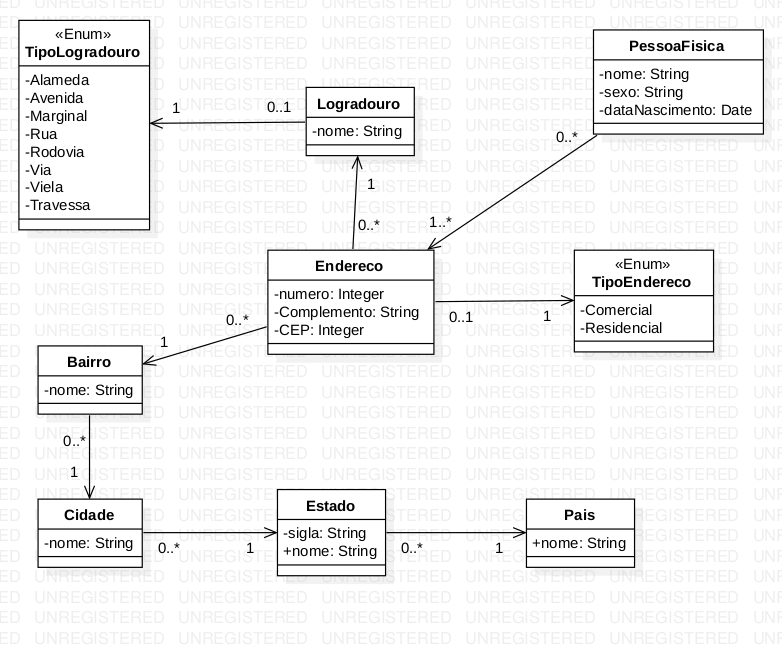

# Construção de Software 2024-1
## Atividade 07 - Implementação do diagrama de classes

Este repositório foi criado com o objetivo de realizar a entrega da atividade 7 da disciplina de construção de software, que consiste em implementar as classes descritas no diagrama a seguir
